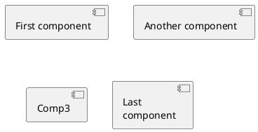

# 学习UML

##  环境

PlantUML: https://plantuml.com/zh

```
wget http://sourceforge.net/projects/plantuml/files/plantuml.jar plantuml.jar 

sudo apt install openjdk-17-jre-headless 

sudo apt install graphviz 

java -jar plantuml.jar test_uml.txt
```

